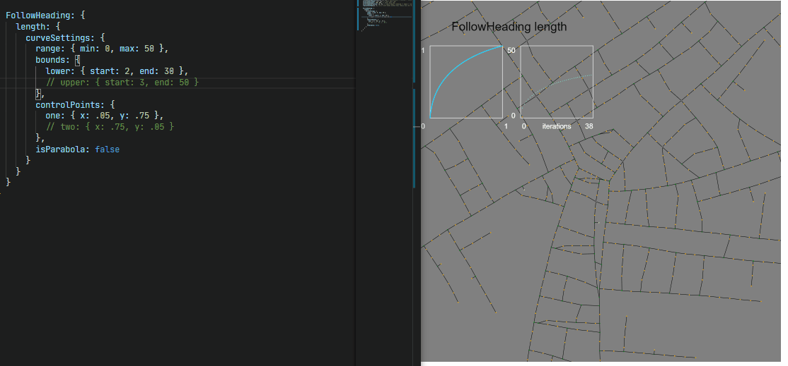

# City Generator
Trying my hand at procedural generation, inspired by the likes of [watawatabou](https://twitter.com/watawatabou) and [Dragons Abound](https://twitter.com/AboundDragons). Needless to say it nowhere near as fancy or pretty. Here's the generation process visualized, typically it just iterates and renders the end state. 

Most of the settings can be configured via json. Parameter values can be made to change while the generation process chugs along to allow for variation. 

The project is made with;

  * [p5js](https://p5js.org)
  * [geometric.js](https://github.com/HarryStevens/geometric) 
  * [bezier.js](https://github.com/Pomax/bezierjs) 
  * [quadtree-lib](https://github.com/elbywan/quadtree-lib) 